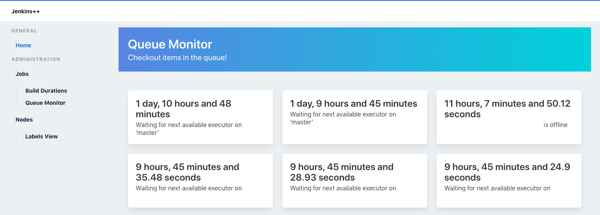

# JenkinsPlusPlus UI
Alternative views for Jenkins

# Run locally via Flask

Setup environment variables:

- export FLASK_APP=app/app.py
- export JENKINS_URL=https://jenkins-url.com/
- export JENKINS_USER=
- export JENKINS_TOKEN=

Run:

`flask run`

# Run via Docker
Setup environment variables on the docker-compose.yml file

Run:

`docker-compose build && docker-compose up`

# Deployment

Build the image and deploy to any container orchestration tool

# Screenshots

- #### Build Durations
  See which builds are currently running and for how long

- #### Queue Durations
  See which builds are currently in queue and for how long

- #### Node Labels Management
  Access nodes via their labels

